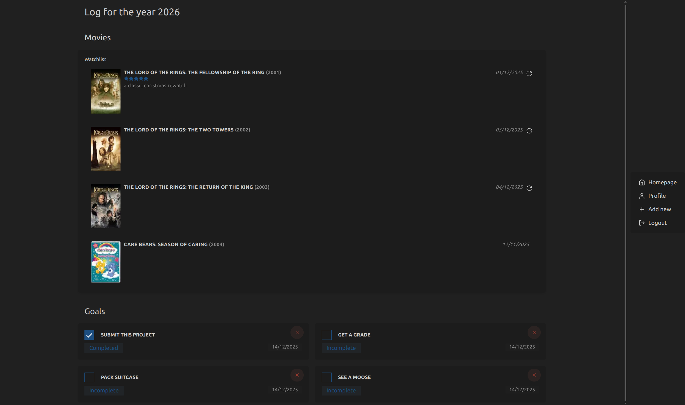
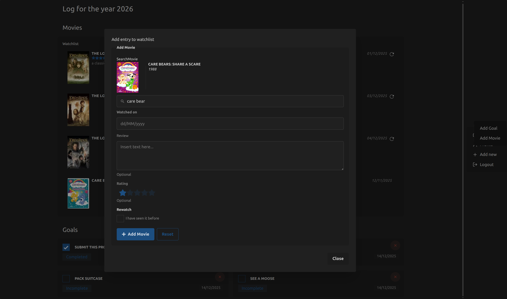
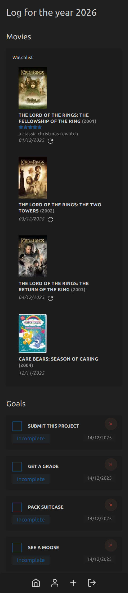

# AnnoLog

A digital scrapbook tool to track your progress through the year.

## Features

- log movies in a watchlist
- goals  tracker
- light and dark mode

## Roadmap

### Features

- tv shows
- video games
- books
- image list
- text post list
- mood and habit tracker
- theme switcher
- export of current lists

### Development

- hosting
- docker setup
- auto formatting and linting
- expanded testing
- captcha to prevent bots
- email authentication

## Setup

There is currently no hosted version. For LUT: In the submission I included the required .env file necessary to run the project.
Include it in the root of the project and run `npm install`.
You may need to cd to `./frontend` and run `npm install` inside of the directory too.

Inside of root, run `npm run prev` to start both the backend and frontend.

The preview mode frontend is running on Port `4173`. absolute

### Test Account

Use these credentials to view an account with logged examples:
Username: lut-tester
Email: <lut@tester.fi>
Password: (same as username)

## Screenshots

## Video

Video can be found here: [./documentation/asset/annolog_video.mkv](./documentation/asset/annolog_video.mkv).

## Learning Diary
The learning diary can be found [here](./documentation/asset/learning_diary_martens_jasmin.pdf)

## Development tidbits

Techstack:

- React
- Redux
- Express.js
- mongoDB and mongoose
- tailwindcss
- daisyUI

External APIs:

- tmDB

### Testing

Currently there is a collection for the `goals` schema and necessary tests to run inside postman.
